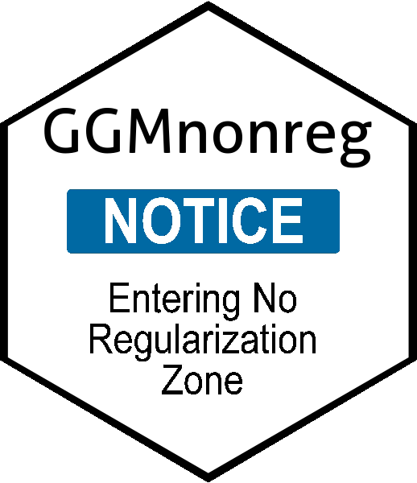
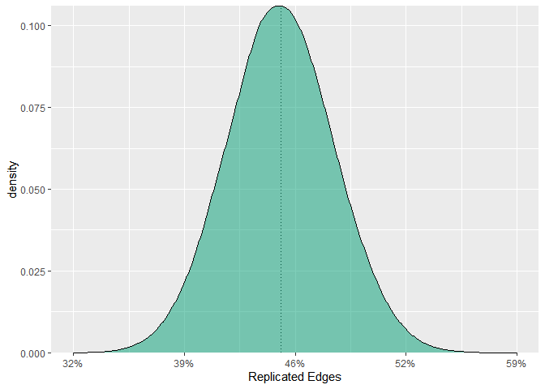

<!-- README.md is generated from README.Rmd. Please edit that file -->



# GGMnonreg: Non-regularized Gaussian Graphical Models

[](https://cran.r-project.org/package=GGMnonreg)
[](https://cran.r-project.org/package=GGMnonreg)
[](https://circleci.com/gh/donaldRwilliams/GGMnonreg)

The goal of **GGMnonreg** is to estimate non-regularized graphical
models. Note that the title is a bit of a misnomer, in that Ising and
mixed graphical models are also supported.

Graphical modeling is quite common in fields with *wide* data, that is,
when there are more variables than observations. Accordingly, many
regularization-based approaches have been developed for those kinds of
data. There are key drawbacks of regularization when the goal is
inference, including, but not limited to, the fact that obtaining a
valid measure of parameter uncertainty is very (very) difficult.

More recently, graphical modeling has emerged in psychology (Epskamp et
al. 2018), where the data is typically long or low-dimensional (*p* \<
*n*; Donald R. Williams et al. 2019; Donald R. Williams and Rast 2019).
The primary purpose of **GGMnonreg** is to provide methods specifically
for low-dimensional data (e.g., those common to psychopathology
networks).

## Supported Models

  - Gaussian graphical model. The following data types are supported.
      - Gaussian
      - Ordinal
      - Binary
  - Ising model (Marsman et al. 2017)
  - Mixed graphical model

## Additional methods

The following are also included

  - Expected network replicability (Williams 2020)
  - Compare Gaussian graphical models
  - Measure of parameter uncertainty (Donald R. Williams et al. 2019)
  - Edge inclusion “probabilities”
  - Network visualization
  - Constrained precision matrix (the network, given an assumed graph)
  - Predictability (variance explained)

## Installation

To install the latest release version (2.0.0) from CRAN use

``` r
install.packages("GGMnonreg")    
```

You can install the development version from
[GitHub](https://github.com/) with:

``` r
# install.packages("devtools")
devtools::install_github("donaldRwilliams/GGMnonreg")
```

## Ising

An Ising model is fitted with the following

``` r
library(GGMnonreg)

# make binary
Y <- ifelse(ptsd[,1:5] == 0, 0, 1)

# fit model
fit <- ising_search(Y, IC = "BIC", 
                    progress = FALSE)

fit
#>          1        2        3        4        5
#> 1 0.000000 1.439583 0.000000 1.273379 0.000000
#> 2 1.439583 0.000000 1.616511 0.000000 1.182281
#> 3 0.000000 1.616511 0.000000 1.716747 1.077322
#> 4 1.273379 0.000000 1.716747 0.000000 1.662550
#> 5 0.000000 1.182281 1.077322 1.662550 0.000000
```

Note the same code, more or less, is also used for GGMs and mixed
graphical models.

## Predictability

It is common to compute predictability, or variance explained, for each
node in the network. An advantage of **GGMnonreg** is that a measure of
uncertainty is also provided.

``` r
# data
Y <- na.omit(bfi[,1:5])

# fit model
fit <- ggm_inference(Y, boot = FALSE)

# predictability
predictability(fit)
#>   Estimate Est.Error Ci.lb Ci.ub
#> 1     0.13      0.01  0.11  0.15
#> 2     0.33      0.01  0.30  0.36
#> 3     0.38      0.01  0.35  0.41
#> 4     0.18      0.01  0.15  0.20
#> 5     0.29      0.01  0.26  0.32
```

## Parameter Uncertainty

Confidence intervals for each relation are obtained with

``` r
# data
Y <- na.omit(bfi[,1:5])

# fit model
fit <- ggm_inference(Y, boot = TRUE, 
                     method = "spearman", 
                     B = 100, progress = FALSE)
#>   |                                                                              |                                                                      |   0%  |                                                                              |=                                                                     |   1%  |                                                                              |=                                                                     |   2%  |                                                                              |==                                                                    |   3%  |                                                                              |===                                                                   |   4%  |                                                                              |====                                                                  |   5%  |                                                                              |====                                                                  |   6%  |                                                                              |=====                                                                 |   7%  |                                                                              |======                                                                |   8%  |                                                                              |======                                                                |   9%  |                                                                              |=======                                                               |  10%  |                                                                              |========                                                              |  11%  |                                                                              |=========                                                             |  12%  |                                                                              |=========                                                             |  13%  |                                                                              |==========                                                            |  14%  |                                                                              |===========                                                           |  15%  |                                                                              |===========                                                           |  16%  |                                                                              |============                                                          |  17%  |                                                                              |=============                                                         |  18%  |                                                                              |==============                                                        |  19%  |                                                                              |==============                                                        |  20%  |                                                                              |===============                                                       |  21%  |                                                                              |================                                                      |  22%  |                                                                              |================                                                      |  23%  |                                                                              |=================                                                     |  24%  |                                                                              |==================                                                    |  26%  |                                                                              |===================                                                   |  27%  |                                                                              |===================                                                   |  28%  |                                                                              |====================                                                  |  29%  |                                                                              |=====================                                                 |  30%  |                                                                              |=====================                                                 |  31%  |                                                                              |======================                                                |  32%  |                                                                              |=======================                                               |  33%  |                                                                              |========================                                              |  34%  |                                                                              |========================                                              |  35%  |                                                                              |=========================                                             |  36%  |                                                                              |==========================                                            |  37%  |                                                                              |==========================                                            |  38%  |                                                                              |===========================                                           |  39%  |                                                                              |============================                                          |  40%  |                                                                              |=============================                                         |  41%  |                                                                              |=============================                                         |  42%  |                                                                              |==============================                                        |  43%  |                                                                              |===============================                                       |  44%  |                                                                              |===============================                                       |  45%  |                                                                              |================================                                      |  46%  |                                                                              |=================================                                     |  47%  |                                                                              |==================================                                    |  48%  |                                                                              |==================================                                    |  49%  |                                                                              |===================================                                   |  50%  |                                                                              |====================================                                  |  51%  |                                                                              |====================================                                  |  52%  |                                                                              |=====================================                                 |  53%  |                                                                              |======================================                                |  54%  |                                                                              |=======================================                               |  55%  |                                                                              |=======================================                               |  56%  |                                                                              |========================================                              |  57%  |                                                                              |=========================================                             |  58%  |                                                                              |=========================================                             |  59%  |                                                                              |==========================================                            |  60%  |                                                                              |===========================================                           |  61%  |                                                                              |============================================                          |  62%  |                                                                              |============================================                          |  63%  |                                                                              |=============================================                         |  64%  |                                                                              |==============================================                        |  65%  |                                                                              |==============================================                        |  66%  |                                                                              |===============================================                       |  67%  |                                                                              |================================================                      |  68%  |                                                                              |=================================================                     |  69%  |                                                                              |=================================================                     |  70%  |                                                                              |==================================================                    |  71%  |                                                                              |===================================================                   |  72%  |                                                                              |===================================================                   |  73%  |                                                                              |====================================================                  |  74%  |                                                                              |=====================================================                 |  76%  |                                                                              |======================================================                |  77%  |                                                                              |======================================================                |  78%  |                                                                              |=======================================================               |  79%  |                                                                              |========================================================              |  80%  |                                                                              |========================================================              |  81%  |                                                                              |=========================================================             |  82%  |                                                                              |==========================================================            |  83%  |                                                                              |===========================================================           |  84%  |                                                                              |===========================================================           |  85%  |                                                                              |============================================================          |  86%  |                                                                              |=============================================================         |  87%  |                                                                              |=============================================================         |  88%  |                                                                              |==============================================================        |  89%  |                                                                              |===============================================================       |  90%  |                                                                              |================================================================      |  91%  |                                                                              |================================================================      |  92%  |                                                                              |=================================================================     |  93%  |                                                                              |==================================================================    |  94%  |                                                                              |==================================================================    |  95%  |                                                                              |===================================================================   |  96%  |                                                                              |====================================================================  |  97%  |                                                                              |===================================================================== |  98%  |                                                                              |===================================================================== |  99%  |                                                                              |======================================================================| 100%

confint(fit)
#>              2.5%        97.5%
#>  [1,] -0.28986230 -0.220159797
#>  [2,] -0.15195946 -0.067920611
#>  [3,]  0.25471799  0.326892397
#>  [4,] -0.03563033  0.036784498
#>  [5,]  0.13659742  0.200947295
#>  [6,]  0.13102537  0.208514266
#>  [7,] -0.07539727  0.006897514
#>  [8,]  0.11035928  0.184802692
#>  [9,]  0.34736929  0.410414759
#> [10,]  0.08170543  0.156450883
```

These can then be plotted with, say, **ggplot2** (left to the user).

## Edge Inclusion

When mining data, or performing an automatic search, it is difficult to
make inference on the network parameters (e.g., confidence are not
easily computed). To summarize data mining, **GGMnonreg** provides edge
inclusion “probabilities” (proportion bootstrap samples for which each
relation was detected).

``` r
# data
Y <- na.omit(bfi[,1:5])

# fit model
fit <-  eip(Y, method = "spearman", 
            B  = 100, progress = FALSE)

fit
#>     eip
#> 1  1.00
#> 2  1.00
#> 3  1.00
#> 4  0.04
#> 5  1.00
#> 6  1.00
#> 7  0.27
#> 8  1.00
#> 9  1.00
#> 10 1.00
```

Note in all cases, the provided estimates correspond to the
upper-triangular elements of the network.

## Expected Network Replicability

**GGMnonreg** allows for computing expected network replicability (ENR),
i.e., the number of effects that will be detected in any number of
replications. This is an analytic solution.

The first step is defining a true network

``` r
# first make the true network
cors <- cor(GGMnonreg::ptsd)

# inverse
inv <- solve(cors)

# partials
pcors <-  -cov2cor(inv)

# set values to zero
pcors <- ifelse(abs(pcors) < 0.05, 0, pcors)
```

Then obtain ENR

``` r
fit_enr <- enr(net = pcors, n = 500, replications = 2)

fit_enr
#> Average Replicability: 0.45 
#> Average Number of Edges: 53 (SD = 3.7) 
#> 
#> ----
#> 
#> Cumulative Probability: 
#> 
#>  prop.edges edges Pr(R > prop.edges)
#>         0.0     0               1.00
#>         0.1    12               1.00
#>         0.2    23               1.00
#>         0.3    35               1.00
#>         0.4    47               0.91
#>         0.5    58               0.05
#>         0.6    70               0.00
#>         0.7    82               0.00
#>         0.8    94               0.00
#>         0.9   105               0.00
#> ----
#> Pr(R > prop.edges):
#> probability of replicating more than the
#> correpsonding proportion (and number) of edges
```

Note this is inherently frequentist. As such, over the long run, 45 % of
the edges will be replicated on average. Then we can further infer that,
in hypothetical replication attempts, more than half of the edges will
be replicated only 5 % of the time.

ENR can also be plotted

``` r
plot(fit_enr)
```



### Intution

Here is the basic idea of ENR

``` r
# location of edges
index <- which(pcors[upper.tri(diag(20))] != 0)

# convert network into correlation matrix
diag(pcors) <- 1
cors_new <- corpcor::pcor2cor(pcors)

# replicated edges
R <- NA

# increase 1000 to, say, 5,000
for(i in 1:1000){

  # two replications
  Y1 <- MASS::mvrnorm(500, rep(0, 20), cors_new)
  Y2 <- MASS::mvrnorm(500, rep(0, 20), cors_new)

  # estimate network 1
  fit1 <- ggm_inference(Y1, boot = FALSE)

  # estimate network 2
  fit2 <- ggm_inference(Y2, boot = FALSE)

  # number of replicated edges (detected in both networks)
  R[i] <- sum(
    rowSums(
      cbind(fit1$adj[upper.tri(diag(20))][index],
            fit2$adj[upper.tri(diag(20))][index])
    ) == 2)
}
```

Notice that replication of two networks is being assessed over the long
run. In other words, if we draw two random samples, what is the expected
replicability.

Compare analytic to simulation

``` r
# combine simulation and analytic
cbind.data.frame(
  data.frame(simulation = sapply(seq(0, 0.9, 0.1), function(x) {
    mean(R > round(length(index) * x) )
  })),
  data.frame(analytic = round(fit_enr$cdf, 3))
)
#>    simulation analytic
#> 1       1.000    1.000
#> 2       1.000    1.000
#> 3       1.000    1.000
#> 4       1.000    1.000
#> 5       0.893    0.912
#> 6       0.064    0.052
#> 7       0.000    0.000
#> 8       0.000    0.000
#> 9       0.000    0.000
#> 10      0.000    0.000

# average replicability (simulation)
mean(R / length(index))
#> [1] 0.4467265

# average replicability (analytic)
fit_enr$ave_pwr
#> [1] 0.4485122
```

ENR works with any correlation, assuming there is an estimate of the
standard error.

## Network plot

``` r
# data
Y <- ptsd

# estimate graph
fit <- ggm_inference(Y, boot = FALSE)

# get info for plotting
plot(get_graph(fit), edge_magnify = 5)
```


## Bug Reports, Feature Requests, and Contributing

Bug reports and feature requests can be made by opening an issue on
[Github](https://github.com/donaldRwilliams/GGMnonreg/issues). To
contribute towards the development of **GGMnonreg**, you can start a
branch with a pull request and we can discuss the proposed changes
there.

## References

<div id="refs" class="references">

<div id="ref-Epskamp2018ggm">

Epskamp, Sacha, Lourens J. Waldorp, Rene Mottus, and Denny Borsboom.
2018. “The Gaussian Graphical Model in Cross-Sectional and Time-Series
Data.” *Multivariate Behavioral Research* 53 (4): 453–80.
<https://doi.org/10.1080/00273171.2018.1454823>.

</div>

<div id="ref-marsman_2018">

Marsman, M, D Borsboom, J Kruis, S Epskamp, R van Bork, L J Waldorp, By
Taylor, L Waldorp, H L J van der Maas, and G Maris. 2017. “An
Introduction to Network Psychometrics: Relating Ising Network Models to
Item Response Theory Models.” *Taylor & Francis* 53 (1): 15–35.
<https://doi.org/10.1080/00273171.2017.1379379>.

</div>

<div id="ref-williams2020learning">

Williams, Donald R. 2020. “Learning to Live with Sampling Variability:
Expected Replicability in Partial Correlation Networks.” *PsyArXiv*.
<https://doi.org/10.31234/osf.io/fb4sa>.

</div>

<div id="ref-williams_rethinking">

Williams, Donald R., and Philippe Rast. 2019. “Back to the basics:
Rethinking partial correlation network methodology.” *British Journal of
Mathematical and Statistical Psychology*.
<https://doi.org/10.1111/bmsp.12173>.

</div>

<div id="ref-williams2019nonregularized">

Williams, Donald R., Mijke Rhemtulla, Anna C Wysocki, and Philippe Rast.
2019. “On Nonregularized Estimation of Psychological Networks.”
*Multivariate Behavioral Research* 54 (5): 719–50.
<https://doi.org/10.1080/00273171.2019.1575716>.

</div>

</div>
