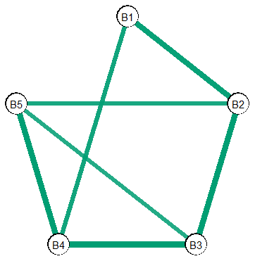

  
# Summary
Studying complex relations in multivariate datasets is a common task across the sciences. Cognitive neuroscientists model brain connectivity with the goal of unearthing functional and structural associations between cortical regions [@ortiz_2015]. In clinical psychology, researchers wish to better understand the intricate web of symptom interrelations that underlie mental health disorders 
[@mcnally_2016; @borsboom_small_world]. To this end, graphical modeling has emerged as an oft-used tool in the chest of scientific inquiry. The basic idea is to characterize multivariate relations by learning the conditional dependence structure. The cortical regions or symptoms are *nodes* and the featured connections linking nodes are *edges* that graphically represent the conditional dependence structure.

Graphical modeling is quite common in fields with wide data, that is, when there are more variables ($p$) than observations ($n$). Accordingly, many regularization-based approaches have been developed for those kinds of data. There are key drawbacks of regularization, including, but not limited to, the fact that obtaining a valid measure of parameter uncertainty is very (very) difficult [@Buhlmann2014] and there can
be an inflated false positive rate [see for example, @williams2019nonregularized].

# Statement of Need
More recently, graphical modeling has emerged in psychology (Epskamp et al. 2018), where the data is typically long or low-dimensional ($p < n$; @williams2019nonregularized, @williams_rethinking). The primary purpose of 
**GGMnonreg** is to provide methods that were specifically designed for low-dimensional data (e.g., those common in the social-behavioral sciences).

## Supported Models
* Gaussian graphical model (GGM). The following data types are supported.
  + Gaussian 
  + Ordinal
  + Binary
* Ising model [@marsman_2018]
* Mixed graphical model

## Additional methods
The following are also included

* Expected network replicability [@williams2020learning]
* Compare Gaussian graphical models
* Measure of parameter uncertainty [@williams2019nonregularized]
* Edge inclusion "probabilities" [e.g., Figure 6.4 in  @Hastie2015]
* Network visualization
* Constrained precision matrix [the network, given an assumed graph, see p. 631 in @hastie2009elements]
* Predictability [variance explained for each node, @Haslbeck2018]

## Gaussian graphical Model
The following estimates a GGM for 5 post-traumatic stress disorder 
(PTSD) symptoms [@armour2017network]:

```{r}
fit <- ggm_inference(Y = ptsd[,1:5], 
                     boot = FALSE)

fit
#>           1         2         3         4         5
#> 1 0.0000000 0.2262934 0.0000000 0.3335737 0.1547986
#> 2 0.2262934 0.0000000 0.4993419 0.0000000 0.0000000
#> 3 0.0000000 0.4993419 0.0000000 0.2205442 0.1841798
#> 4 0.3335737 0.0000000 0.2205442 0.0000000 0.3407634
#> 5 0.1547986 0.0000000 0.1841798 0.3407634 0.0000000
```

### Predictability
It is common to then estimate "predictability", which corresponds to $R^2$
for each node in the network. In **GGMnonreg**, this is implemented with the 
following code:

```{r}
predictability(fit)

#>   Estimate Est.Error Ci.lb Ci.ub
#> 1     0.45      0.05  0.35  0.54
#> 2     0.50      0.05  0.41  0.59
#> 3     0.55      0.04  0.47  0.64
#> 4     0.50      0.05  0.41  0.59
#> 5     0.46      0.05  0.37  0.55
```


## Ising Model
An Ising model is for binary data. The PTSD symptoms can be binary, indicating
the symptom was either present or absent. This network is estimated with:

```{r}
# make binary
Y <- ifelse(ptsd[,1:5] == 0, 0, 1)

# fit model
fit <- ising_search(Y, IC = "BIC", 
                    progress = FALSE)

fit
#>          1        2        3        4        5
#> 1 0.000000 1.439583 0.000000 1.273379 0.000000
#> 2 1.439583 0.000000 1.616511 0.000000 1.182281
#> 3 0.000000 1.616511 0.000000 1.716747 1.077322
#> 4 1.273379 0.000000 1.716747 0.000000 1.662550
#> 5 0.000000 1.182281 1.077322 1.662550 0.000000
```

## Network Replicability
Recently, the topic of replicability has captivated the network literature. 
To this end, I developed an analytic solution to estimate replicability [@williams2020learning].

The first step is to define a "true" partial correlation network. As an example, 
I generate a synthetic partial correlation matrix, and then compute expected
network replicability.

```{r}
# edges between 0.05 and 0.25
main <- gen_net(p = 20, 
                lb = 0.05, 
                ub = 0.25)

# enr                
enr(main$pcors, 
    n = 500, 
    replications = 4)

#> Average Replicability: 0.53 
#> Average Number of Edges: 30 (SD = 2.12) 
#> 
#> ----
#> 
#> Cumulative Probability: 
#> 
#>  prop.edges edges Pr(R > prop.edges)
#>         0.0     0               1.00
#>         0.1     6               1.00
#>         0.2    11               1.00
#>         0.3    17               1.00
#>         0.4    23               1.00
#>         0.5    28               0.78
#>         0.6    34               0.02
#>         0.7    40               0.00
#>         0.8    46               0.00
#>         0.9    51               0.00
----
Pr(R > prop.edges):
probability of replicating more than the
correpsonding proportion (and number) of edges
```
On average, we see that we can expect to replicate roughly half of the 
edges in four replication attempts, where replication is defined as detecting 
a given edge in each attempt. Further, the probability of replicating more than 
70% of the edges is zero.


## Network Visualization
A key aspect of graphical modeling is visualizing the conditional dependence structure. To this end, 
**GGMnonreg** makes network plots with **ggplot2** [@ggplotpackage].

```
plot(get_graph(fit), 
     node_names = colnames(Y), 
     edge_magnify = 2)
```


# Acknowledgements
DRW was supported by a National Science Foundation Graduate Research Fellowship
under Grant No. 1650042


# References

